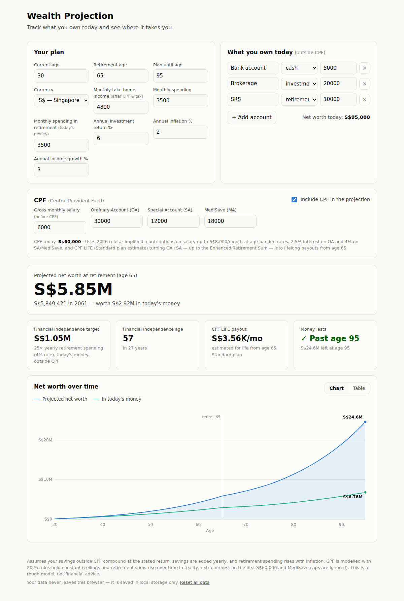

# Wealth Projection

A small, dependency-free website for tracking your finances today and projecting
your wealth into the future — built with a Singapore context (CPF, SGD) but
usable anywhere. Enter what you own, your income and spending, and a few
assumptions — it shows your projected net worth year by year, when you reach
financial independence, and whether your money lasts through retirement.

Everything runs in the browser; your data is saved to local storage and never
leaves your machine.

<picture>
  <source media="(prefers-color-scheme: dark)" srcset="docs/screenshot-dark.png">
  
</picture>

## Running it

It's a static site — no build step, no dependencies. Serve the folder and open it:

```sh
python3 -m http.server 8000
# then open http://localhost:8000
```

(Any static file server works; it also deploys as-is to GitHub Pages or similar.
A server is needed because the JavaScript uses ES modules, which browsers block
on `file://` URLs.)

## What it shows

- **Hero figure** — projected net worth at your retirement age, nominal and in
  today's money.
- **Stat tiles** — your financial-independence target (25× yearly retirement
  spending, the 4% rule), the age you reach it, peak net worth, and whether your
  money lasts to the end of the plan.
- **Interactive chart** — net worth over time, nominal and inflation-adjusted,
  with a retirement marker, crosshair tooltip (mouse or arrow keys), and
  automatic light/dark theme.
- **Table view** — the same projection as year-by-year figures: net worth,
  today's-money value, CPF balance, amount saved or withdrawn, and investment
  growth.

## The model

Annual steps, deliberately simple:

- Savings outside CPF compound at the stated investment return.
- While working, yearly savings (take-home income − spending) are added; income
  grows at its own rate and spending rises with inflation.
- From retirement age on, that year's inflation-adjusted retirement spending is
  withdrawn instead (net of CPF LIFE payouts once they start). If liquid
  savings hit zero they stay there (no borrowing).
- "Today's money" divides nominal values by cumulative inflation.
- Financial independence is measured against assets *outside* CPF, since CPF is
  locked until the payout age.

### CPF (Singapore)

The optional CPF module models the Central Provident Fund with 2026 rules:

- **Contributions** — total (employer + employee) rates on gross salary up to
  the S$8,000/month Ordinary Wage ceiling: 37% up to age 55, then 34%
  (55–60), 25% (60–65), 16.5% (65–70), and 12.5% after 70, while you work.
- **Interest** — 2.5% on the Ordinary Account, 4% on Special Account and
  MediSave (the floor rates).
- **CPF LIFE** — at 65, OA+SA up to the Enhanced Retirement Sum (S$440,800) is
  annuitized into a lifelong monthly payout, estimated at ~9.7% of the
  annuitized sum per year (the Standard plan's FRS estimate: S$220,400 →
  ~S$1,780/month). Anything above the ERS becomes withdrawable. The unused
  premium counts toward net worth as it amortizes, mirroring the plan's
  bequest refund.

Simplifications, in the interest of staying understandable: 2026 ceilings and
retirement sums are held constant in nominal terms (they rise over time in
reality); contribution allocation uses the under-35 OA/SA/MA split at every
age; the extra 1% interest on the first S$60,000 and the MediSave cap (BHS)
are ignored; take-home income is assumed to already exclude the employee's
CPF share.

This is a rough planning model, not financial advice — it also ignores taxes,
sequence-of-returns risk, and asset allocation.

CPF parameters (in `js/projection.js`) are based on:
[CPF contribution rates from 1 Jan 2026](https://www.cpf.gov.sg/employer/employer-obligations/how-much-cpf-contributions-to-pay) ·
[2026 retirement sums and payout estimates](https://www.cpf.gov.sg/service/article/what-is-the-current-enhanced-retirement-sum) ·
[senior-worker rate changes](https://www.cpf.gov.sg/service/article/what-are-the-changes-to-the-cpf-contribution-rates-for-senior-workers-from-1-january-2026)

## Project layout

```
index.html            page structure
styles.css            theme (light/dark), layout, chart chrome
js/projection.js      pure projection engine (no DOM)
js/chart.js           interactive SVG chart renderer
js/app.js             state, persistence, inputs, tiles, table
tests/                engine tests
```

## Tests

```sh
node --test tests/projection.test.mjs
```
